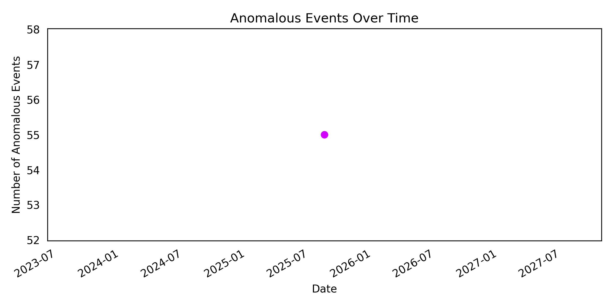
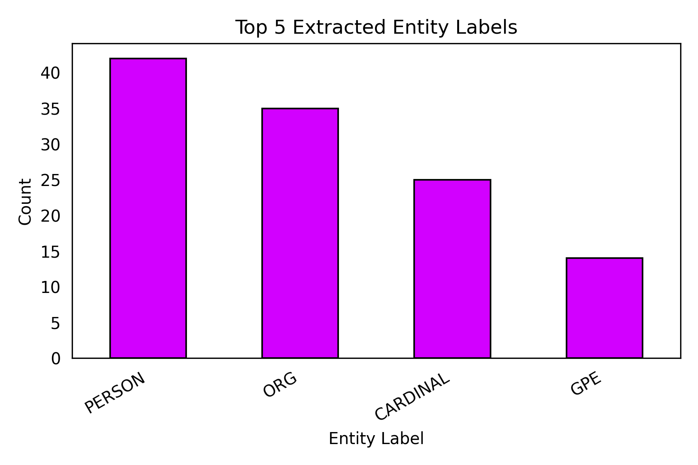

# Forensic Investigation Report

**Date Generated:** 2025-09-12 12:52:57

## Executive Summary
This forensic investigation identified **55 anomalous events** and extracted multiple key entities from the available evidence. The analysis highlights suspicious network connections, unauthorized login attempts, and communications involving sensitive projects.

## Methodology
The following steps were carried out in this forensic investigation:
1. Acquired raw dataset (`raw_evidence.csv`).
2. Preprocessed and cleaned data (`cleaned_evidence.csv`).
3. Engineered features (`feature_engineered_evidence.csv`).
4. Detected anomalies (`anomalies_detected_evidence.csv`).
5. Extracted entities (`extracted_entities.csv`).

## Key Findings
- **Total anomalies detected:** 55

### Anomalous Event Types
- logout: 15
- login: 12
- network_connection: 12
- file_access: 10
- email_sent: 6

### Top Extracted Entities (Labels)
- PERSON: 42
- ORG: 35
- CARDINAL: 25
- GPE: 14

### Top Extracted Entities (Texts)
- 8080: 14
- Email: 14
- Jane Doe: 14
- John Doe: 14
- London: 14

## Visualizations
Below are visualizations generated from the analysis:

### Timeline of Anomalous Events

### Distribution of Entity Labels

